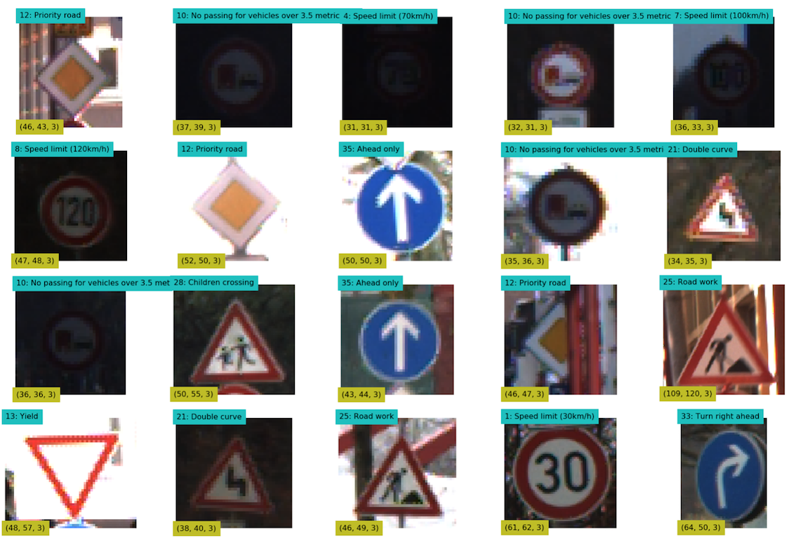
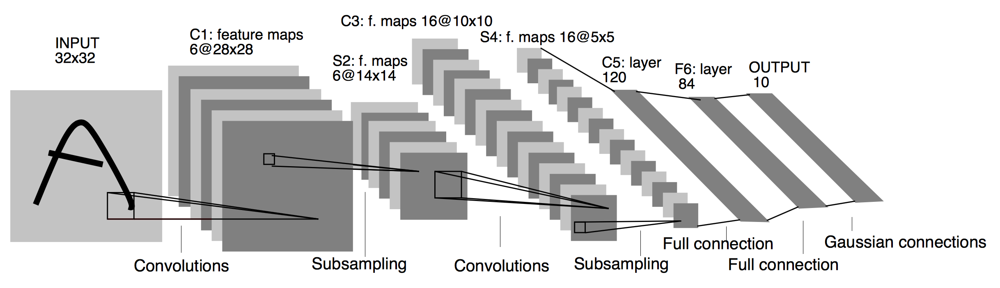

# Traffic Sign Classification

In this project, I've built and trained a deep neural network to classify German traffic signs using Tensorflow and Scikit-Learn's Pipeline framework.



# Getting Started

You can set up the required python library as follows:

```
conda env create -f environments-gpu.yml  # with GPU
```

If you have no CUDA-enabled GPU, you can use the following:

```
conda env create -f environments.yml  # with CPU
```

You can start the notebook as follows:

```
jupyter notebook Traffic_Sign_Classifier.ipynb
```

Alternatively, you can view the notebook in the HTML export (`Traffic_Sign_Classifier.html`).

# Train and Test Data

The project is initially based on one of the assignments in the Udacity’s Self-Driving Car Engineer course.  After completion, I re-worked on the project using the original image data format from [German Traffic Sign Benchmarks](http://benchmark.ini.rub.de/?section=gtsrb&subsection=dataset) website so that it does not require people to use the images from the Udacity (which is already resized to 32x32 and in the pickle format).

## How to Download

- http://benchmark.ini.rub.de/Dataset/GTSRB_Final_Training_Images.zip
- http://benchmark.ini.rub.de/Dataset/GTSRB_Final_Test_Images.zip
- http://benchmark.ini.rub.de/Dataset/GTSRB_Final_Test_GT.zip

I downloaded them to my machine as follows:

```
> mkdir data

> # use wget or curl 
> wget http://benchmark.ini.rub.de/Dataset/GTSRB_Final_Training_Images.zip
> unzip GTSRB_Final_Training_Images.zip
> mv GTSRB/Final_Training data/

> wget http://benchmark.ini.rub.de/Dataset/GTSRB_Final_Test_Images.zip
> unzip GTSRB_Final_Test_Images.zip
> mv GTSRB/Final_Test/ data/

> wget http://benchmark.ini.rub.de/Dataset/GTSRB_Final_Test_GT.zip
> unzip GTSRB_Final_Test_GT.zip
> mv GT-final_test.csv data/Final_Test/Images/
```

## Folder Structure

The training images are organized in folders by category.  Each folder is meant for one category (i.e. stop sign) and has a label file (.csv) which is actually semi-colon delimited (not comma delimited).

```
data
 + Final_Training
    + Images
        + 00000
            + 00000_00000.ppm
            + 00000_00001.ppm
            ...    
            + GT-00000.csv
        + 00001
            + 00000_00000.ppm
            + 00000_00001.ppm
            ...    
            + GT-00001.csv
        ...
```

All images are stored in the PPM format ([Portable Pixmap, P6](http://en.wikipedia.org/wiki/Netpbm_format)).  You'll need to install both `matplotlib` and `pillow` to handle such image format.  If you use one of the evironments yml files in this repository, this will be taken care of.

Test images do not have category folders but all are kept in one place with one label file.

```
data
 + Final_Test
    + Images
        + 00000.ppm
        + 00001.ppm
        + ...
        + GT-final_test.csv      # Extended annotations including class ids
        + GT-final_test.test.csv
```

# Model Architecture

## LeNet

The model is based on [LeNet](http://yann.lecun.com/exdb/lenet/) by Yann LeCun.  It is a convolutional neural network designed to recognize visual patterns directly from pixel images with minimal preprocessing.  It can handle hand-written characters very well. 



Source: http://yann.lecun.com/exdb/publis/pdf/lecun-98.pdf

- The inputs are 32x32 (Black-White 1 channel) images
- LeNet uses 2x2 sub-sampling (valid padding, max pooling) in convolutional layers (no dropout)
- LeNet uses a sigmoid squashing function - a scaled hyperbolic tangent: $Atanh(Sa)$ where A=1.7159 and S=2/3
- LeNet has one 7x12 bitmap for each class, which is a label.  There are 10 classes (the digits '0' - '9')
- 7x12 = 84 which is why the output is 84
- The output is compared with all the labels (bitmaps) to calculate the error
- The class with the smallest error is an estimated digit value

## The Model 

Our model is adapted from the LeNet as follows.  

- The inputs are 32x32 (RGB - 3 channels) images
- The activation function is ReLU except for the output layer which uses Softmax
- The output has 43 classes

|Layer                       | Shape    |
|----------------------------|:--------:|
|Input                       | 32x32x3  |
|Convolution (valid, 5x5x6)  | 28x28x6  |
|Max Pooling (valid, 2x2)    | 14x14x6  |
|Activation  (ReLU)          | 14x14x6  |
|Convolution (valid, 5x5x16) | 10x10x16 |
|Max Pooling (valid, 2x2)    | 5x5x16   |
|Activation  (ReLU)          | 5x5x16   |
|Flatten                     | 400      |
|Dense                       | 120      |
|Activation  (ReLU)          | 120      |
|Dense                       | 43       |
|Activation  (Softmax)       | 43       |

# Pipeline Implementation

The `pipeline` folder has all the Python classes for building pipelines using the Tensorflow and Scikit-Learn's Pipeline framework.  I used pipelines extensively to test out various preprocessing and network architecture scenarios.

It allows me to write convolutional neural networks as follows:

```python
INPUT_SHAPE = (32, 32, 3)

def make_network1(input_shape=INPUT_SHAPE):
    return (NeuralNetwork()
            .input(input_shape)
            .conv([5, 5, 6])
            .max_pool()
            .relu()
            .conv([5, 5, 16])
            .max_pool()
            .relu()
            .flatten()
            .dense(120)
            .relu()
            .dense(N_CLASSES))
```

A network is then adapted into an estimator that can be used as part of Scikit-Learn's Pipeline object.  I also have a helper class to adapt any functions into a transformer that can be used in a Pipeline object.

# References:

- German Traffic Sign Benchmarks: [http://benchmark.ini.rub.de/?section=gtsrb&subsection=dataset]
- The PPM format (Portable Pixmap, P6): [http://en.wikipedia.org/wiki/Netpbm_format]
- LeNet Demo (Yann LeCun): [http://yann.lecun.com/exdb/lenet/]
- Gradient-Based Learning Applied to Document Recognition (Yann LeCun): [http://yann.lecun.com/exdb/publis/pdf/lecun-98.pdf]
- Keras with Scikit-Learn Pipeline: [http://machinelearningmastery.com/regression-tutorial-keras-deep-learning-library-python/]
- My Github for German Traffic Sign Classifier: [https://github.com/naokishibuya/car-traffic-sign-classification] 
- Udacity: Self-Driving Car Engineer: Traffic Sign Classifier Project: [https://github.com/udacity/CarND-Traffic-Sign-Classifier-Project]

